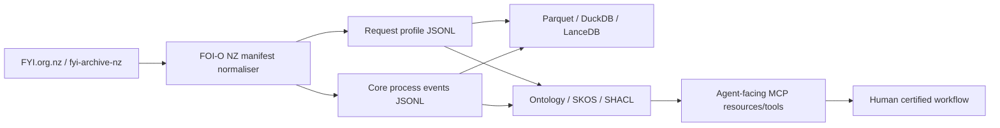

# FOI-O NZ

[](https://github.com/edithatogo/foi-o-nz/actions/workflows/ci.yml)
[](https://docs.modular.com/)
[](https://www.python.org/)
[](https://github.com/astral-sh/ruff)
[](LICENSE.md)

**Agent-facing process model, ontology, validation stack, and analytical workbench for New Zealand Official Information Act administration.**

FOI-O NZ is the semantic/process layer that sits beside the existing FYI ecosystem:

| Repository | Role |
| --- | --- |
| `fyi-cli` | Capture, local request management, Alaveteli-compatible monitoring, dashboards, exports. |
| `fyi-archive` | Read-only archive orchestration, manifests, provenance, Hugging Face/Zenodo/OSF distribution. |
| `foi-o-nz` | Process/event ontology, JSON Schema, SKOS, SHACL, agent safety contracts, analytics, evaluation, and future MCP resources/tools. |

The first milestone is **not** an autonomous FOI decision system. It is an auditable event model that lets agents help with process management while preserving human certification boundaries.



## Implementation stance

This repository is intentionally **bleeding edge, but bounded**:

- **Mojo/MAX-first compiled core** for deterministic state/event kernels, future high-performance NLP, and future custom acceleration.
- **Python bridge/control plane** for mature data engineering: Polars, DuckDB, PyArrow, LanceDB, Pydantic, RDFLib, and JSON Schema.
- **Process-first design**: model events, states, evidence, provenance, clocks, and authority boundaries before trying to model every legal concept.
- **Epistemic status is first-class**: `observed`, `inferred`, `asserted`, `certified`, `unknown`.
- **Human certification boundary is hard-coded**: agents can draft, flag, route, validate, and summarise; they cannot certify release/refusal/redaction/charging/extension/complaint outcomes.

## Quick start

### Python control plane

```bash
uv sync --extra dev --extra analytics --frozen
uv run foi-o-nz doctor
uv run foi-o-nz smoke-fixture --output-dir data/smoke
uv run foi-o-nz validate examples/core-event.extension-notified.json --schema schemas/json/core-event.schema.json
uv run foi-o-nz map-state successful
```

### Mojo/MAX experimental core

```bash
pixi install
pixi run mojo-format-check
pixi run mojo-test
pixi run mojo-build
```

The Mojo layer is deliberately small in v0.1: deterministic state mapping and certification-boundary checks. Heavy ingestion/query work remains in Polars/DuckDB until Mojo-native dataframe/Arrow tooling is mature enough for production use.

### Normalise FYI manifest records

```bash
uv run foi-o-nz normalise-manifest \
  --input path/to/fyi-archive-nz-manifest.jsonl \
  --requests-output data/processed/requests.jsonl \
  --events-output data/processed/events.jsonl \
  --parquet-dir data/processed/parquet
```

The normaliser accepts JSONL or JSON arrays containing FYI archive-style records with fields such as `request_id`, `url_title`, `title`, `authority`, `state`, `first_sent`, `last_updated`, `content_sha256`, `html_captured`, `attachments`, and `warc_record_ids`.

## Repository layout

```text
foi-o-nz/
├── mojo/                         # Mojo package and native tests
├── src/foi_o_nz/                 # Python bridge/control plane
├── schemas/json/                 # JSON Schema contracts
├── ontology/                     # OWL/RDF/Turtle ontology seed
├── shacl/                        # SHACL validation shapes
├── vocab/                        # SKOS controlled vocabularies
├── mappings/                     # Alaveteli/FYI, PSC, NZ legislation mappings
├── pipelines/                    # Pipeline notes and generated-output contracts
├── manifests/                    # Small committed validation manifests only
├── examples/                     # Valid examples and state-machine diagrams
├── prompts/                      # Bounded prompts for extraction/state mapping
├── tests/                        # Python tests and schema checks
├── docs/                         # Architecture, governance, roadmap
├── adr/                          # Architecture decision records
├── pixi.toml                     # Mojo/MAX environment
├── pyproject.toml                # Python bridge and quality tooling
└── Makefile
```

## Current surfaces

| Surface | Status | Purpose |
| --- | --- | --- |
| JSON Schemas | Implemented | Validate core events, request profiles, agent actions, reporting metrics. |
| Python models | Implemented | Strict Pydantic models matching the schemas. |
| State mapper | Implemented | Rule-based FYI/Alaveteli state normalisation with confidence/evidence semantics. |
| Manifest normaliser | Implemented | Converts FYI archive records into request profiles and core observed events. |
| Analytics bridge | Implemented | Optional Polars/DuckDB outputs and summaries. |
| Mojo kernel | Experimental | Native state mapping and human-certification guard functions. |
| Ontology/SKOS/SHACL | Seeded | First-pass semantic layer for later review. |
| MCP server | Planned | To be built after event/profile contracts stabilise. |
| MAX inference | Planned | To be used for local extraction/embeddings once process contracts are stable. |

## Human/agent boundary

Agents may:

- map observed FYI states to normalised process states;
- create candidate events from public manifests;
- calculate indicative clocks with warnings;
- draft search plans, correspondence, and quality checks;
- prepare disclosure-log metadata and reporting extracts.

Agents must not autonomously certify:

- access/refusal decisions;
- redactions or releases;
- withholding grounds;
- public-interest balancing;
- charges;
- extensions/transfers where a statutory decision or notice is required;
- complaint/review outcomes.

## Licence and notice

Code, schemas, ontology seed, and documentation are MIT licensed. Source request/archive content remains subject to its original rights and platform terms. This repository is not an official New Zealand government or Ombudsman publication channel.
