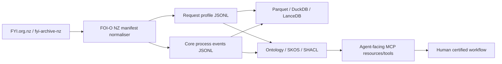

# FOI-O NZ

[](https://github.com/edithatogo/foi-o-nz/actions/workflows/ci.yml)
[](https://docs.modular.com/)
[](https://www.python.org/)
[](https://github.com/astral-sh/ruff)
[](LICENSE.md)

**Agent-facing process model, ontology, validation stack, and analytical workbench for New Zealand Official Information Act administration.**

FOI-O NZ is the semantic/process layer that sits beside the existing FYI ecosystem:

| Repository | Role |
| --- | --- |
| `fyi-cli` | Capture, local request management, Alaveteli-compatible monitoring, dashboards, exports. |
| `fyi-archive` | Read-only archive orchestration, manifests, provenance, Hugging Face/Zenodo/OSF distribution. |
| `foi-o-nz` | Process/event ontology, JSON Schema, SKOS, SHACL, agent safety contracts, analytics, evaluation, and future MCP resources/tools. |

The first milestone is **not** an autonomous FOI decision system. It is an auditable event model that lets agents help with process management while preserving human certification boundaries.



## Implementation stance

This repository is intentionally **bleeding edge, but bounded**:

- **Mojo/MAX-first compiled core** for deterministic state/event kernels, future high-performance NLP, and future custom acceleration.
- **Python bridge/control plane** for mature data engineering: Polars, DuckDB, PyArrow, LanceDB, Pydantic, RDFLib, and JSON Schema.
- **Process-first design**: model events, states, evidence, provenance, clocks, and authority boundaries before trying to model every legal concept.
- **Epistemic status is first-class**: `observed`, `inferred`, `asserted`, `certified`, `unknown`.
- **Human certification boundary is hard-coded**: agents can draft, flag, route, validate, and summarise; they cannot certify release/refusal/redaction/charging/extension/complaint outcomes.

## Quick start

### Python control plane

```bash
uv sync --extra dev --extra analytics --extra mcp --extra rdf --frozen
uv run foi-o-nz doctor
uv run foi-o-nz smoke-fixture --output-dir data/smoke
uv run foi-o-nz validate examples/core-event.extension-notified.json --schema schemas/json/core-event.schema.json
uv run foi-o-nz map-state successful
uv run foi-o-nz clock 2026-12-23
```

### Mojo/MAX experimental core

```bash
pixi install
pixi run mojo-format-check
pixi run mojo-test
pixi run mojo-build
```

The Mojo layer is deliberately small in v0.5: deterministic state mapping, text-planning helpers, machine-working-day checks, and certification-boundary guards. Heavy ingestion/query work remains in Polars/DuckDB until Mojo-native dataframe/Arrow tooling is mature enough for production use.

### Normalise FYI manifest records

```bash
uv run foi-o-nz normalise-manifest \
  --input path/to/fyi-archive-nz-manifest.jsonl \
  --requests-output data/processed/requests.jsonl \
  --events-output data/processed/events.jsonl \
  --parquet-dir data/processed/parquet \
  --run-manifest-output data/processed/run-manifest.json

uv run foi-o-nz validate-jsonl data/processed/requests.jsonl --schema schemas/json/request-profile.schema.json
uv run foi-o-nz validate-jsonl data/processed/events.jsonl --schema schemas/json/core-event.schema.json
uv run foi-o-nz event-summary data/processed/events.jsonl --output data/processed/event-summary.json
uv run foi-o-nz quality-gate data/processed/events.jsonl --output data/processed/quality-report.json
uv run foi-o-nz transition-audit data/processed/events.jsonl --output data/processed/transition-report.json
uv run foi-o-nz chunk-jsonl --input data/processed/requests.jsonl --output data/processed/request-chunks.jsonl --kind request
uv run foi-o-nz risk-scan --input data/processed/request-chunks.jsonl --output data/processed/risk-assessments.jsonl
uv run foi-o-nz search-chunks \
  --input data/processed/request-chunks.jsonl \
  --query "extension transfer clarification" \
  --output data/processed/retrieval-results.json
uv run foi-o-nz propose-redactions \
  --input data/processed/request-chunks.jsonl \
  --output data/processed/redaction-candidates.jsonl
uv run foi-o-nz build-agent-pack \
  --request-id 12345 \
  --requests-jsonl data/processed/requests.jsonl \
  --events-jsonl data/processed/events.jsonl \
  --chunks-jsonl data/processed/request-chunks.jsonl \
  --risks-jsonl data/processed/risk-assessments.jsonl \
  --retrieval-json data/processed/retrieval-results.json \
  --redaction-candidates-jsonl data/processed/redaction-candidates.jsonl \
  --output data/processed/agent-pack.12345.json
uv run foi-o-nz build-ledger --input data/processed/events.jsonl --output data/processed/events.ledger.jsonl --record-type event
uv run foi-o-nz verify-ledger --input data/processed/events.jsonl --ledger data/processed/events.ledger.jsonl --record-type event
uv run foi-o-nz embed-jsonl --input data/processed/requests.jsonl --output data/processed/request-embeddings.jsonl --kind request
uv run foi-o-nz export-rdf \
  --requests-jsonl data/processed/requests.jsonl \
  --events-jsonl data/processed/events.jsonl \
  --output data/processed/foi-o-nz.ttl
uv run foi-o-nz dataset-metadata data/processed/requests.jsonl data/processed/events.jsonl data/processed/request-chunks.jsonl --output data/processed/dataset-metadata.json --base-dir .
uv run foi-o-nz dataset-metadata data/processed/requests.jsonl data/processed/events.jsonl data/processed/request-chunks.jsonl --output data/processed/croissant.json --base-dir . --croissant
uv run foi-o-nz dataset-metadata data/processed/requests.jsonl data/processed/events.jsonl data/processed/request-chunks.jsonl --output data/processed/README.md --base-dir . --hf-card
uv run foi-o-nz export-openapi --output data/processed/openapi.json
uv run foi-o-nz export-tool-manifest --output data/processed/tool-manifest.json
uv run foi-o-nz diff-jsonl \
  --before data/previous/events.jsonl \
  --after data/processed/events.jsonl \
  --output data/processed/events.diff.json
uv run foi-o-nz repro-manifest \
  data/processed/requests.jsonl data/processed/events.jsonl data/processed/request-chunks.jsonl \
  --output data/processed/reproducibility-manifest.json \
  --base-dir .
```

The normaliser accepts JSONL or JSON arrays containing FYI archive-style records with fields such as `request_id`, `url_title`, `title`, `authority`, `state`, `first_sent`, `last_updated`, `content_sha256`, `html_captured`, `attachments`, and `warc_record_ids`. It also looks for message-like fields (`messages`, `correspondence`, `communications`, `updates`) and emits conservative `MessageObserved` plus candidate process events such as `ExtensionNotified`, `TransferNotified`, `ClarificationRequested`, `ComplaintObserved`, and decision/release/refusal candidates that require human review.

### Batch/vector/RDF utilities

```bash
uv run foi-o-nz normalise-batch data/raw --requests-output data/processed/requests.jsonl --events-output data/processed/events.jsonl
uv run foi-o-nz export-jsonld-context --output contexts/foi-o-nz.context.jsonld
uv run foi-o-nz validate-shacl data/processed/foi-o-nz.ttl --shapes shacl/foi-o-nz.shapes.ttl
uv run foi-o-nz build-lancedb data/processed/request-embeddings.jsonl --database-dir data/vector/lancedb
uv run foi-o-nz schema-drift
uv run foi-o-nz evaluate-events --predicted data/processed/events.jsonl --gold data/gold/events.gold.jsonl
uv run foi-o-nz agent-action-template map_state --output data/processed/action.map-state.json
uv run foi-o-nz evaluate-agent-action data/processed/action.map-state.json
uv run foi-o-nz mcp-server
```

`build-lancedb` and `mcp-server` require optional extras. The default embedding
provider is a deterministic feature-hashing baseline for reproducible local tests;
it is not a semantic model.

## Repository layout

```text
foi-o-nz/
├── mojo/                         # Mojo package and native tests
├── src/foi_o_nz/                 # Python bridge/control plane
├── schemas/json/                 # JSON Schema contracts
├── ontology/                     # OWL/RDF/Turtle ontology seed
├── shacl/                        # SHACL validation shapes
├── vocab/                        # SKOS controlled vocabularies
├── mappings/                     # Alaveteli/FYI, PSC, NZ legislation mappings
├── pipelines/                    # Pipeline notes and generated-output contracts
├── manifests/                    # Small committed validation manifests only
├── examples/                     # Valid examples and state-machine diagrams
├── prompts/                      # Bounded prompts for extraction/state mapping
├── tests/                        # Python tests and schema checks
├── docs/                         # Architecture, governance, roadmap
├── adr/                          # Architecture decision records
├── pixi.toml                     # Mojo/MAX environment
├── pyproject.toml                # Python bridge and quality tooling
└── Makefile
```

## Current surfaces

| Surface | Status | Purpose |
| --- | --- | --- |
| JSON Schemas | Implemented | Validate core events, request profiles, agent actions, reporting metrics, and run manifests. |
| Python models | Implemented | Strict Pydantic models matching the schemas. |
| State mapper | Implemented | Rule-based FYI/Alaveteli state normalisation with confidence/evidence semantics. |
| Manifest normaliser | Implemented | Converts FYI archive records into request profiles, deadline annotations, attachments, message events, and candidate process events. |
| Event analytics | Implemented | Summaries for request profiles and event streams without mandatory dataframe dependencies. |
| Quality gates | Implemented | Scans event streams for missing evidence, certification-boundary violations, and provenance issues. |
| RDF exporter | Implemented | Converts request/event JSONL into Turtle/JSON-LD-compatible RDF via RDFLib. |
| Analytics bridge | Implemented | Optional Polars/DuckDB outputs, DuckDB bootstrap SQL, and summaries. |
| Mojo kernel | Experimental | Native state mapping, machine-working-day checks, and human-certification guard functions. |
| Ontology/SKOS/SHACL | Seeded | First-pass semantic layer for later review. |
| MCP server | Experimental | Optional FastMCP server exposing state mapping, validation, and quality-gate tools only. |
| Text chunks | Implemented | Creates deterministic request/event chunks for vector indexing and agent context windows. |
| Tamper-evident ledgers | Implemented | SHA-256 JSON canonicalisation and hash chaining for request/event/chunk/embedding streams. |
| Risk triage | Implemented | Deterministic review-trigger scans for privacy/health/withholding/AI-workload signals; never a legal decision. |
| Dataset metadata | Implemented | FOI-O NZ metadata, Frictionless-style datapackages, Croissant-style JSON-LD, and Hugging Face dataset-card scaffolds. |
| Agent contracts | Implemented | OpenAPI skeleton and bounded tool manifest for future agent runtime integration. |
| Local retrieval | Implemented | BM25-ish lexical search plus deterministic feature-hash vector blending over agent chunks. |
| Redaction candidates | Implemented | Regex-based sensitive-span candidates with hashed/masked previews; no redaction decision. |
| Agent context packs | Implemented | Request-scoped packages combining request, events, chunks, risks, retrieval, redaction candidates, constraints, and provenance. |
| Stream diffs | Implemented | Canonical JSONL added/removed/modified/unchanged reports for incremental archive processing. |
| Reproducibility manifests | Implemented | Local tool availability and file SHA-256 manifests for CI/release evidence. |
| MAX inference | Planned | To be used for local extraction/embeddings once process contracts are stable; v0.5 keeps deterministic embeddings local and dependency-light. |

## Human/agent boundary

Agents may:

- map observed FYI states to normalised process states;
- create candidate events from public manifests;
- calculate indicative clocks with warnings;
- draft search plans, correspondence, and quality checks;
- prepare disclosure-log metadata and reporting extracts.

Agents must not autonomously certify:

- access/refusal decisions;
- redactions or releases;
- withholding grounds;
- public-interest balancing;
- charges;
- extensions/transfers where a statutory decision or notice is required;
- complaint/review outcomes.

## Licence and notice

Code, schemas, ontology seed, and documentation are MIT licensed. Source request/archive content remains subject to its original rights and platform terms. This repository is not an official New Zealand government or Ombudsman publication channel.
