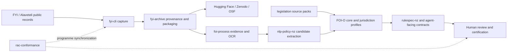

# FOI-O

[](https://github.com/edithatogo/foi-o/actions/workflows/ci.yml)
[](https://docs.modular.com/)
[](https://www.python.org/)
[](https://github.com/astral-sh/ruff)
[](LICENSE.md)

**Global agent-facing process model, ontology, validation stack, and analytical workbench for freedom-of-information administration. Developed first through New Zealand's OIA and iterated through Australian jurisdictions.**

FOI-O is a global model with a jurisdiction-neutral core and independently
versioned legal profiles. It started with New Zealand's OIA, whose package
remains the mature reference implementation in this repository, and has since
iterated through Australian Commonwealth and NSW adapters. Those Australian
adapters remain candidate-only until their empirical and human legal-review
gates pass. FOI-O is one part of a wider, deliberately separated FOI data and
governance programme:

| Repository | Role |
| --- | --- |
| [`fyi-cli`](https://github.com/edithatogo/fyi-cli) | Capture, delta inputs, local request management, and Alaveteli-compatible monitoring and exports. |
| [`fyi-archive`](https://github.com/edithatogo/fyi-archive) | Read-only archive orchestration, manifests, provenance, dataset packaging, and publication to Hugging Face, Zenodo, and OSF. |
| [`foi-process`](https://github.com/edithatogo/foi-process) | Integration spine for document evidence, OCR, and process views. |
| [`foi-o`](https://github.com/edithatogo/foi-o) | Core ontology method plus versioned process and jurisdiction contracts; this repository currently packages the NZ implementation as `foi-o-nz`. |
| [`nlp-policy-nz`](https://github.com/edithatogo/nlp-policy-nz) | Review-bounded extraction and empirical adapter evaluation; its outputs remain candidates until promoted by humans. |
| [`rulespec-nz`](https://github.com/edithatogo/rulespec-nz) | Deterministic New Zealand rule specifications. |
| [`legislation`](https://github.com/edithatogo/legislation) | Versioned legislation and source packs used by jurisdiction profiles. |
| [`rac-conformance`](https://github.com/edithatogo/rac-conformance) | Cross-repository programme synchronization and conformance evidence. |

The first milestone is **not** an autonomous FOI decision system. It is an auditable event model that lets agents help with process management while preserving human certification boundaries.



## Implementation stance

This repository is intentionally **bleeding edge, but bounded**:

- **Mojo/MAX-first compiled core** for deterministic state/event kernels, future high-performance NLP, and future custom acceleration.
- **Python bridge/control plane** for mature data engineering: Polars, DuckDB, PyArrow, LanceDB, Pydantic, RDFLib, and JSON Schema.
- **Process-first design**: model events, states, evidence, provenance, clocks, and authority boundaries before trying to model every legal concept.
- **Epistemic status is first-class**: `observed`, `inferred`, `asserted`, `certified`, `unknown`.
- **Human certification boundary is hard-coded**: agents can draft, flag, route, validate, and summarise; they cannot certify release/refusal/redaction/charging/extension/complaint outcomes.

## Core/profile boundary

FOI-O's core is the global process-modelling method and conceptual frame for
freedom-of-information workflows. New Zealand is its origin and mature
reference implementation, not the limit of the model. Australian Commonwealth
and New South Wales work represents the next jurisdiction iterations, but each
remains a **candidate contract pilot**, not a promoted legal profile. Global
scope therefore describes the architecture and governance method; it does not
claim that every jurisdiction is already modelled, legally approved, or
production-ready.

## Current programme status

As at **16 July 2026**:

- the NZ package and its dependency-light validation surfaces are implemented;
- FOI-O V2 adds empirical extraction contracts and explicit promotion evidence,
  while preserving the V1 provenance, epistemic-status, and human-certification
  safeguards;
- Australia is planned as `foi-o-au` plus independently versioned subdivision
  profiles such as `foi-o-au-nsw`, rather than long-lived jurisdiction branches;
- Commonwealth and NSW are the first adapter pilots, but remain candidate-only;
  the other states and territories remain disabled until source, rights,
  annotation, evaluation, and human-approval gates are met; and
- `fyi-archive` is the packaging and publication boundary for the corresponding
  Hugging Face datasets. FOI-O consumes pinned, provenance-bearing artifacts and
  does not treat mutable remote data as certified legal evidence.

No adapter or model output can autonomously approve a legal interpretation,
withholding ground, release, refusal, redaction, charge, extension, transfer, or
review outcome.

## Documentation

- [System architecture](docs/02-system-architecture.md)
- [Roadmap](docs/08-roadmap.md)
- [Implementation status](docs/11-implementation-status.md)
- [Ontology and jurisdiction profile versioning](docs/39-ontology-versioning-and-jurisdiction-profiles.md)

## Quick start

### Python control plane

```bash
uv sync --extra dev --extra analytics --extra mcp --extra rdf --frozen
uv run foi-o-nz doctor
uv run foi-o-nz smoke-fixture --output-dir data/smoke
uv run foi-o-nz validate examples/core-event.extension-notified.json --schema schemas/json/core-event.schema.json
uv run foi-o-nz map-state successful
uv run foi-o-nz clock 2026-12-23
```

### Mojo/MAX experimental core

```bash
pixi install
pixi run mojo-format-check
pixi run mojo-test
pixi run mojo-build
```

The Mojo layer is deliberately small but expanding in v0.8: deterministic state mapping, text-planning helpers, machine-working-day checks, and certification-boundary guards. Heavy ingestion/query work remains in Polars/DuckDB until Mojo-native dataframe/Arrow tooling is mature enough for production use.

## Version and jurisdiction policy

The package version is the version of the reusable FOI-O core/profile contract.
Every release must keep `pyproject.toml`, `pixi.toml`, `CITATION.cff`, the
runtime version, and the generated OpenAPI contract aligned. A release tag is
published only after the release-metadata check passes and the exact tag commit
is recorded in the programme citation ledger.

Jurisdiction profiles are additive and independently governed. The current
validated package is `foi-o-nz`; planned profiles use identifiers such as
`foi-o-au-com` and `foi-o-au-nsw`. A profile may be `candidate`, `validated`,
or `stable`, but only human-reviewed source manifests can promote a profile
to a certified surface. Profiles do not replace FOI-O core semantics or the
authoritative `legislation` source provider.

### Type-safety ratchet

CI runs both `ty` and BasedPyright. Use `make typecheck` for the rapid
development check and `make typecheck-basedpyright` for the final static gate.
The checkers complement tests; neither replaces behavioral, integration, or
release testing. The configured `ty` rules promote unresolved imports,
unresolved attributes, and invalid assignments to errors. BasedPyright applies
its strict rule set to a documented initial set of repaired runtime modules,
while the rest of the repository remains under its standard no-regression
baseline. Narrow exclusions preserve executable governance files whose exact
bytes are authorization-pinned. The tracked
`basedpyright-baseline.json` records legacy findings so they cannot silently
grow; new findings fail CI. Reduce the baseline with `make typecheck-basedpyright`
and regenerate it only after reviewing the diff.

### Test profiles

The default `make test` target runs the complete pytest suite with four
work-stealing workers (`make test-fast`). Use `make test-full` before a normal
commit to combine lint, formatting, both type checkers, the parallel suite, and
repository/schema validation. Use `make test-serial` when reproducing ordering
or isolation failures and for final release evidence.

Normal CI uses the four-worker profile on Python 3.12 and the governed
diagnostics runtime Python 3.14.5. A scheduled or manually dispatched job
retains an independent serial Python 3.14.5 run, and the
release workflow also runs the suite serially before building distributions.
Parallel success is therefore not treated as proof that the suite is free of
ordering or worker-isolation defects. On typical developer hardware the
parallel profile should be materially faster, but no fixed duration is part of
the contract because workload and storage performance vary.

### Normalise FYI manifest records

```bash
uv run foi-o-nz normalise-manifest \
  --input path/to/fyi-archive-nz-manifest.jsonl \
  --requests-output data/processed/requests.jsonl \
  --events-output data/processed/events.jsonl \
  --parquet-dir data/processed/parquet \
  --run-manifest-output data/processed/run-manifest.json

uv run foi-o-nz validate-jsonl data/processed/requests.jsonl --schema schemas/json/request-profile.schema.json
uv run foi-o-nz validate-jsonl data/processed/events.jsonl --schema schemas/json/core-event.schema.json
uv run foi-o-nz event-summary data/processed/events.jsonl --output data/processed/event-summary.json
uv run foi-o-nz quality-gate data/processed/events.jsonl --output data/processed/quality-report.json
uv run foi-o-nz transition-audit data/processed/events.jsonl --output data/processed/transition-report.json
uv run foi-o-nz chunk-jsonl --input data/processed/requests.jsonl --output data/processed/request-chunks.jsonl --kind request
uv run foi-o-nz risk-scan --input data/processed/request-chunks.jsonl --output data/processed/risk-assessments.jsonl
uv run foi-o-nz search-chunks \
  --input data/processed/request-chunks.jsonl \
  --query "extension transfer clarification" \
  --output data/processed/retrieval-results.json
uv run foi-o-nz propose-redactions \
  --input data/processed/request-chunks.jsonl \
  --output data/processed/redaction-candidates.jsonl
uv run foi-o-nz reporting-metrics
uv run foi-o-nz psc-report \
  data/processed/events.jsonl \
  --output data/processed/psc-report.json
uv run foi-o-nz build-agent-pack \
  --request-id 12345 \
  --requests-jsonl data/processed/requests.jsonl \
  --events-jsonl data/processed/events.jsonl \
  --chunks-jsonl data/processed/request-chunks.jsonl \
  --risks-jsonl data/processed/risk-assessments.jsonl \
  --retrieval-json data/processed/retrieval-results.json \
  --redaction-candidates-jsonl data/processed/redaction-candidates.jsonl \
  --output data/processed/agent-pack.12345.json
uv run foi-o-nz build-ledger --input data/processed/events.jsonl --output data/processed/events.ledger.jsonl --record-type event
uv run foi-o-nz verify-ledger --input data/processed/events.jsonl --ledger data/processed/events.ledger.jsonl --record-type event
uv run foi-o-nz embed-jsonl --input data/processed/requests.jsonl --output data/processed/request-embeddings.jsonl --kind request
uv run foi-o-nz export-rdf \
  --requests-jsonl data/processed/requests.jsonl \
  --events-jsonl data/processed/events.jsonl \
  --output data/processed/foi-o-nz.ttl
uv run foi-o-nz dataset-metadata data/processed/requests.jsonl data/processed/events.jsonl data/processed/request-chunks.jsonl --output data/processed/dataset-metadata.json --base-dir .
uv run foi-o-nz dataset-metadata data/processed/requests.jsonl data/processed/events.jsonl data/processed/request-chunks.jsonl --output data/processed/croissant.json --base-dir . --croissant
uv run foi-o-nz dataset-metadata data/processed/requests.jsonl data/processed/events.jsonl data/processed/request-chunks.jsonl --output data/processed/README.md --base-dir . --hf-card
uv run foi-o-nz export-openapi --output data/processed/openapi.json
uv run foi-o-nz export-tool-manifest --output data/processed/tool-manifest.json
uv run foi-o-nz diff-jsonl \
  --before data/previous/events.jsonl \
  --after data/processed/events.jsonl \
  --output data/processed/events.diff.json
uv run foi-o-nz repro-manifest \
  data/processed/requests.jsonl data/processed/events.jsonl data/processed/request-chunks.jsonl \
  --output data/processed/reproducibility-manifest.json \
  --base-dir .
```

The normaliser accepts JSONL or JSON arrays containing FYI archive-style records with fields such as `request_id`, `url_title`, `title`, `authority`, `state`, `first_sent`, `last_updated`, `content_sha256`, `html_captured`, `attachments`, and `warc_record_ids`. It also looks for message-like fields (`messages`, `correspondence`, `communications`, `updates`) and emits conservative `MessageObserved` plus candidate process events such as `ExtensionNotified`, `TransferNotified`, `ClarificationRequested`, `ComplaintObserved`, and decision/release/refusal candidates that require human review.

Reporting outputs are public FYI-derived research indicators, not official PSC reporting. `reporting-metrics` prints the derivability profile, and `psc-report` produces a deterministic aggregate report with warning and caveat fields. The committed sample at `examples/psc-report.small.json` is generated from `examples/events.psc-report-sample.jsonl`.

### Batch/vector/RDF utilities

```bash
uv run foi-o-nz normalise-batch data/raw --requests-output data/processed/requests.jsonl --events-output data/processed/events.jsonl
uv run foi-o-nz export-jsonld-context --output contexts/foi-o-nz.context.jsonld
uv run foi-o-nz validate-shacl data/processed/foi-o-nz.ttl --shapes shacl/foi-o-nz.shapes.ttl
uv run foi-o-nz build-lancedb data/processed/request-embeddings.jsonl --database-dir data/vector/lancedb
uv run foi-o-nz search-lancedb data/processed/request-embeddings.jsonl --query "hospital policy" --database-dir data/vector/lancedb
uv run foi-o-nz prepare-local-extraction --input data/processed/requests.jsonl --output data/processed/local-extraction-requests.jsonl --text-field title
uv run foi-o-nz schema-drift
uv run foi-o-nz evaluate-events --predicted data/processed/events.jsonl --gold data/gold/events.gold.jsonl --output data/processed/event-evaluation.json
uv run foi-o-nz agent-action-template map_state --output data/processed/action.map-state.json
uv run foi-o-nz evaluate-agent-action data/processed/action.map-state.json
uv run foi-o-nz mcp-server
```

`build-lancedb`, LanceDB-backed search, and `mcp-server` require optional extras.
The default embedding provider is a deterministic feature-hashing baseline for
reproducible local tests; it is not a semantic model. `prepare-local-extraction`
creates candidate-only local/MAX prompt packs with `generated_output_included:
false`, `review_required: true`, and no machine certification.

### MCP runtime and agent descriptor checks

The optional MCP runtime is read-only and preparatory. It exposes state mapping,
JSON/JSONL validation, event-stream quality checks, committed schema resources,
and bounded state-mapping prompt context. It does not expose tools for release,
refusal, redaction, charging, transfer, extension, complaint, or review outcome
certification.

```bash
uv run foi-o-nz export-mcp-bundle --output data/processed/mcp-bundle.json
uv run foi-o-nz export-tool-manifest --output data/processed/tool-manifest.json
uv run foi-o-nz export-openapi --output data/processed/openapi.json
uv run pytest -q tests/test_agent_descriptors.py tests/test_mcp_runtime.py
uv run python - <<'PY'
from foi_o_nz.mcp_server import create_server, mcp_runtime_status
print(mcp_runtime_status())
create_server()
PY
uv run foi-o-nz mcp-server
```

If FastMCP is unavailable, `mcp_runtime_status()` reports degraded mode and
`create_server()` fails closed with an installation message instead of exposing a
partial fallback server.

## Repository layout

```text
foi-o-nz/
├── mojo/                         # Mojo package and native tests
├── src/foi_o_nz/                 # Python bridge/control plane
├── schemas/json/                 # JSON Schema contracts
├── ontology/                     # OWL/RDF/Turtle ontology seed
├── shacl/                        # SHACL validation shapes
├── vocab/                        # SKOS controlled vocabularies
├── mappings/                     # Alaveteli/FYI, PSC, NZ legislation mappings
├── pipelines/                    # Pipeline notes and generated-output contracts
├── manifests/                    # Small committed validation manifests only
├── examples/                     # Valid examples and state-machine diagrams
├── prompts/                      # Bounded prompts for extraction/state mapping
├── tests/                        # Python tests and schema checks
├── docs/                         # Architecture, governance, roadmap
├── adr/                          # Architecture decision records
├── pixi.toml                     # Mojo/MAX environment
├── pyproject.toml                # Python bridge and quality tooling
└── Makefile
```

## Current surfaces

| Surface | Status | Purpose |
| --- | --- | --- |
| JSON Schemas | Implemented | Validate core events, request profiles, agent actions, reporting metrics, and run manifests. |
| Python models | Implemented | Strict Pydantic models matching the schemas. |
| State mapper | Implemented | Rule-based FYI/Alaveteli state normalisation with confidence/evidence semantics. |
| Manifest normaliser | Implemented | Converts FYI archive records into request profiles, deadline annotations, attachments, message events, and candidate process events. |
| Event analytics | Implemented | Summaries for request profiles and event streams without mandatory dataframe dependencies. |
| PSC reporting profile | Implemented | Derivability mapping and sample aggregate reports for public FYI-derived indicators, not official PSC reporting. |
| Quality gates | Implemented | Scans event streams for missing evidence, certification-boundary violations, and provenance issues. |
| RDF exporter | Implemented | Converts request/event JSONL into Turtle/JSON-LD-compatible RDF via RDFLib. |
| Analytics bridge | Implemented | Optional Polars/DuckDB outputs, DuckDB bootstrap SQL, and summaries. |
| Mojo kernel | Experimental | Native state mapping, machine-working-day checks, and human-certification guard functions. |
| Ontology/SKOS/SHACL | Implemented | FOIO namespace, OWL/SKOS terms, SHACL safety profiles, semantic export alignment, and pySHACL/degraded-mode validation. |
| MCP server | Experimental | Optional FastMCP server exposing state mapping, validation, and quality-gate tools only. |
| Text chunks | Implemented | Creates deterministic request/event chunks for vector indexing and agent context windows. |
| Tamper-evident ledgers | Implemented | SHA-256 JSON canonicalisation and hash chaining for request/event/chunk/embedding streams. |
| Risk triage | Implemented | Deterministic review-trigger scans for privacy/health/withholding/AI-workload signals; never a legal decision. |
| Dataset metadata | Implemented | FOI-O NZ metadata, Frictionless-style datapackages, Croissant-style JSON-LD, and Hugging Face dataset-card scaffolds. |
| Release package | Implemented | Machine-readable release checklist, repository-release metadata, methods paper draft, and explicit external publication gates. |
| Agent contracts | Implemented | OpenAPI skeleton and bounded tool manifest for future agent runtime integration. |
| V2 extraction contract | Implemented | Versioned, hash-pinned `nlp-policy-nz` candidate-extraction contract covering ontology, schemas, codebook, provenance, capabilities, status vocabulary, and migration behavior, with offline consumer fixtures for FOI-O, `fyi-archive`, `nlp-policy-nz`, and read-only MCP. This is not a V2 software release or upstream consumer approval. |
| Re-extraction input audit | Implemented | Read-only manifest integrity and rights-completeness audit. The verified `fc27…` snapshot fails closed because all 33,217 records lack a declared licence; no extraction or empirical comparison is claimed. |
| Local retrieval | Implemented | BM25-ish lexical search plus deterministic feature-hash vector blending over agent chunks. |
| Redaction candidates | Implemented | Regex-based sensitive-span candidates with hashed/masked previews; no redaction decision. |
| Agent context packs | Implemented | Request-scoped packages combining request, events, chunks, risks, retrieval, redaction candidates, constraints, and provenance. |
| Stream diffs | Implemented | Canonical JSONL added/removed/modified/unchanged reports for incremental archive processing. |
| Reproducibility manifests | Implemented | Local tool availability and file SHA-256 manifests for CI/release evidence. |
| Local/MAX inference packs | Experimental | Candidate-only prompt-pack generation for local/MAX extraction experiments with deterministic provider fallback, human-review routing, and no machine certification. |
| LanceDB retrieval | Experimental | Optional local LanceDB table/search path over deterministic embedding JSONL with deterministic in-memory fallback. |

## Human/agent boundary

Agents may:

- map observed FYI states to normalised process states;
- create candidate events from public manifests;
- calculate indicative clocks with warnings;
- draft search plans, correspondence, and quality checks;
- prepare disclosure-log metadata and reporting extracts.

Agents must not autonomously certify:

- access/refusal decisions;
- redactions or releases;
- withholding grounds;
- public-interest balancing;
- charges;
- extensions/transfers where a statutory decision or notice is required;
- complaint/review outcomes.

## Licence and notice

Code, schemas, ontology seed, and documentation are MIT licensed. Source request/archive content remains subject to its original rights and platform terms. This repository is not an official New Zealand government or Ombudsman publication channel.


## v0.6+ additional commands

```text
foi-o-nz cas-manifest
foi-o-nz materialise-cas
foi-o-nz lineage-graph
foi-o-nz trace-artifacts
foi-o-nz build-goldset
foi-o-nz replay-guardrails
foi-o-nz build-review-queue
foi-o-nz process-advice
foi-o-nz export-annotation-tasks
foi-o-nz export-graph
foi-o-nz export-table-contracts
foi-o-nz materialise-oci
foi-o-nz export-mcp-bundle
foi-o-nz attest-artifacts
foi-o-nz sample-goldset
```

## v0.7 Mojo-first kernel facade

v0.7 makes the native/fallback boundary explicit. The preferred direction is:

```text
Mojo deterministic kernels
  → state, clock, guardrail, transition, retrieval, text, redaction-helper, hash-helper logic
Python fallback
  → identical dependency-light semantics for environments without Mojo/MAX
Python control plane
  → schema validation, JSONL/Parquet/RDF/DuckDB/LanceDB/MCP orchestration
```

Useful commands:

```bash
uv run foi-o-nz kernel-status --output data/processed/native-kernel-status.json
uv run foi-o-nz kernel-eval normalise_alaveteli_state successful
uv run foi-o-nz kernel-conformance --output data/processed/kernel-conformance.json
```

The conformance report verifies that the Python fallback matches the expected
kernel contract. If a compiled Mojo binary is available via `FOI_O_NZ_MOJO_KERNEL`
or `build/foi-o-nz-mojo`, the facade attempts to call it; otherwise it reports
`python-fallback` and keeps the same deterministic semantics.


## v0.8 static Mojo audit and kernel manifest

v0.8 pushes the repository closer to a Mojo-first architecture while retaining Python as the executable fallback in environments without Modular tooling. The new static audit and manifest commands answer three questions without needing the Mojo compiler locally:

1. Which deterministic operations are part of the native-kernel contract?
2. Does the Mojo source tree declare matching functions for every Python fallback operation?
3. What remains blocked before a native Mojo release can be certified?

Useful commands:

```bash
uv run foi-o-nz mojo-audit --output data/processed/mojo-audit.json
uv run foi-o-nz export-kernel-manifest --output data/processed/kernel-manifest.json
uv run foi-o-nz export-kernel-fixtures --output mojo/tests/fixtures/kernel-conformance.jsonl
uv run foi-o-nz kernel-readiness --output data/processed/kernel-readiness.json
uv run foi-o-nz kernel-eval confidence_band 0.74
uv run foi-o-nz kernel-eval stable_text_bucket foi-o-nz 16
```

The static audit is intentionally not a substitute for native compilation. A native release still requires:

```bash
pixi run mojo-format-check
pixi run mojo-test
pixi run mojo-build
PYTHONPATH=src python -m pytest -q
```

In this repository, Python fallback semantics are the compatibility contract; Mojo kernels are expected to match them.
