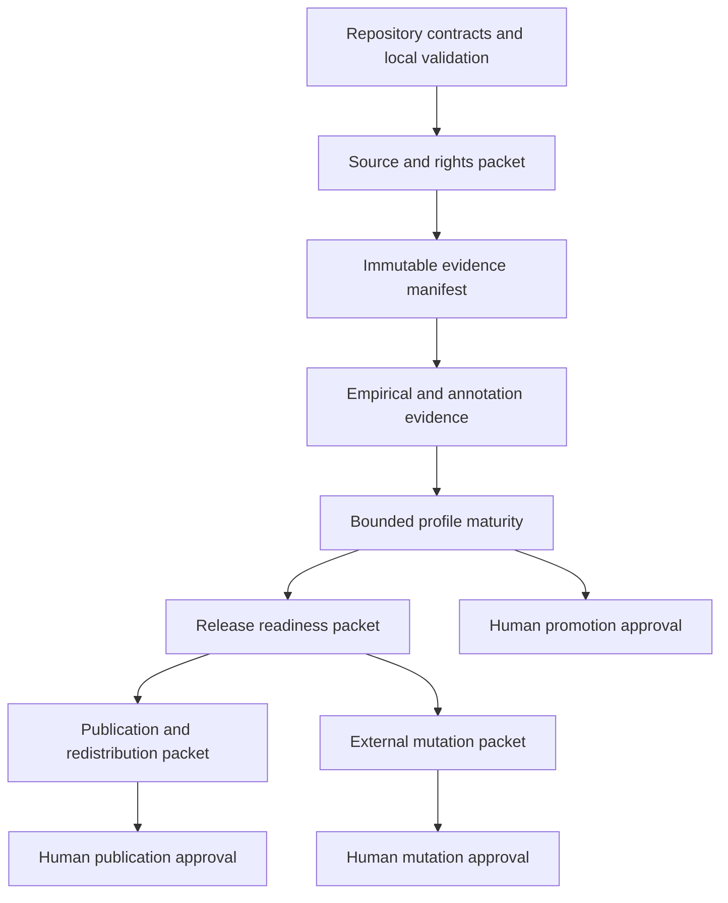

# Human-gate closeout plan

Status: planning only; no external mutation, release, publication, registry
submission, or profile promotion is authorized by this document.

## Purpose

Consolidate the remaining accountable decisions for FOI-O and the Australian
rollout. Repository checks, agent panels, local manifests, and hosted green
checks are evidence inputs; they do not replace the accountable human gate.

## Gate model

| Gate | Required evidence before asking | Human decision | Prohibited shortcut |
| --- | --- | --- | --- |
| G1 source/right acceptance | official identity, effective date, terms, rights, retrieval receipt, SHA-256, parser fixture | accept restricted-local source candidate and its permitted use | treating public availability or a mirror as permission |
| G2 empirical freeze | immutable manifest, population derivation, exclusions, duplicate rules, seed, rights boundary | freeze exact evidence population | inferring population from a platform tag or latest capture |
| G3 annotation execution | approved codebook/protocol, membership hash, blinded packets, role isolation | authorize analyst/adjudicator execution | promoting automated labels to gold without review |
| G4 profile promotion | source pack, contract suite, holdout reliability, extractor metrics, maturity packet | promote candidate to bounded mature status | equating adapter implementation with maturity |
| G5 release | exact commit/tag, release checklist, reproducibility report, dependency/security results, rollback plan | authorize repository/package release | treating a merged PR as a release |
| G6 publication/redistribution | rights matrix, attribution/disclaimer, redaction review, artifact list, destination and audience | authorize HF/Zenodo/GitHub/site publication | publishing because a dry run succeeds |
| G7 external mutation | exact repo, branch, head, action, protections/checks, rollback | authorize push, PR state change, merge, tag, or dispatch | bypassing branch protection or using stale checks |
| G8 legal/accountability | named accountable custodian and scope-specific statement | accept legal/profile or public claim | agent-generated legal certification |

## Dependency sequence

The branches after release readiness remain independent: a repository merge
does not authorize publication, and a publication approval does not authorize
runtime activation or a new source capture.

## Work that can proceed autonomously

1. Inventory exact heads, checks, tags, manifests, source hashes, and track
   references.
2. Generate candidate release, publication, and mutation packets without
   sending, submitting, tagging, publishing, or merging them.
3. Run repository-native validators, schema checks, negative fixtures, and
   reproducibility dry runs.
4. Produce rights matrices that mark unknown, restricted, excluded, and
   redistributable material separately.
5. Reconcile Conductor plans, metadata, evidence ledgers, Git notes, and issue
   links without changing external state.
6. Stop fyi-archive PR #327 at its Codecov gate until coverage reaches the
   unchanged repository threshold; do not weaken the threshold.

## Gate packets to prepare

### Promotion packet

Separate AU-CTH and AU-NSW bounded mature decisions from the seven remaining
jurisdictions. For each remaining jurisdiction require source/right evidence,
contract tests, holdout evidence, reliability, extractor metrics, and explicit
scope limitations.

### Release packet

Pin the exact FOI-O commit, dependency revisions, generated artifacts, schema
versions, test results, security results, changelog, reproducibility command,
rollback procedure, and unresolved external gates. A release candidate is not
a release.

### Publication packet

List every artifact, byte hash, source licence/notice, attribution, redaction
status, destination, audience, retention policy, and whether the payload is
code, metadata, derived statistics, or source text. Default to metadata and
code only when source redistribution is not approved.

### External-mutation packet

Record repository, exact branch/head, requested action, required checks,
branch-protection status, actor, timestamp, rollback, and whether the action
changes source, runtime, release, or publication state. Dispatches must include
the exact workflow inputs and confirmation token.

## Options and recommendation

### Option A — staged gate packets (recommended)

Prepare all packets now, then request only the next decision whose dependencies
are complete. This minimizes stale approvals and preserves separation between
promotion, release, publication, and mutation.

### Option B — one omnibus approval

Efficient administratively, but unsafe because later source, rights, hashes,
checks, and destinations may differ from the approval context.

### Option C — repository-only closeout

Complete local readiness documentation and leave all external actions pending.
This is the safe fallback when credentials, rights, or custodians are
unavailable, but it does not complete release or publication.

Recommendation: Option A, with Option C automatically used for any gate whose
external evidence is missing or stale.

## Contingencies

- **Stale or changed head:** regenerate the packet and re-run checks; never use
  an approval bound to an older SHA.
- **Failed required check:** diagnose and repair in the owning repository;
  never bypass protection or waive a substantive threshold.
- **Rights ambiguity:** retain restricted local, mark the artifact blocked, and
  request a custodian decision; do not publish or redistribute.
- **Credential/registration gate:** prepare an interactive checklist and stop
  for user login; never place secrets in files, logs, notes, or packets.
- **Promotion metrics below threshold:** retain candidate status, open a
  remediation queue, and do not promote by exception.
- **Destination unavailable:** keep a validated local packet and immutable
  hashes; do not substitute an unapproved destination.
- **Human decision changes scope:** invalidate downstream packets and
  regenerate all affected hashes and lineage.

## Decisions to request when packets are complete

Present grouped approvals with exact hashes and links:

1. bounded source/right acceptance;
2. empirical freeze or annotation execution;
3. profile promotion within named scope;
4. release/tag or package publication;
5. dataset/site publication and redistribution;
6. exact external mutation (push, PR state, merge, tag, or dispatch).

Each request must state what it does not authorize.
