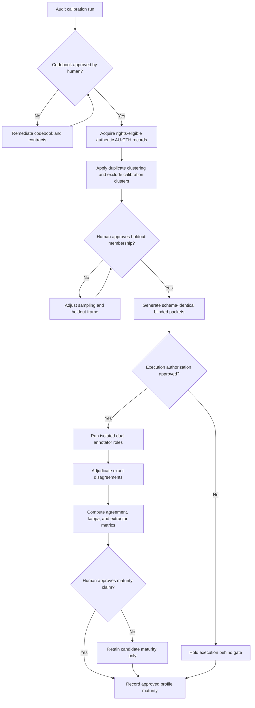

# AU-CTH annotation reliability remediation workflow

Every transition requires predecessor hash pins, codebook version alignment,
and deterministic validator verification. Calibration clusters are strictly excluded
from the fresh holdout. Agent roles remain isolated and unblinded to peer labels.
Maturity claims, legal certification, publication, and gold promotion remain
explicit human gates.
