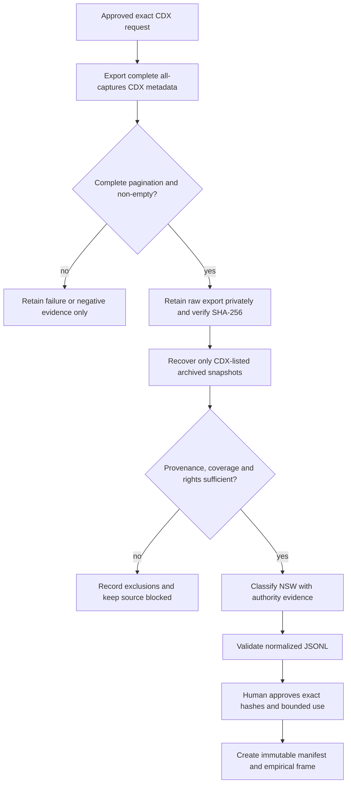

# AU-NSW historical source recovery plan

Status: repository recovery support implemented; no CDX export, replay,
manifest, empirical frame, publication, redistribution, training, legal
conclusion, or profile-promotion action is authorized by this plan.

## Purpose and correction

The prior Internet Archive route used CDX `collapse=urlkey`. That is a
`url_index`: it discovers one archived record per URL and is not an export of
all historical capture versions. `fyi-archive` commit `4d410d6` now distinguishes
that lightweight scheduled mode from a manually confirmed `all_captures` mode,
which preserves timestamped CDX records without URL collapse.

The Internet Archive CDX index is a locator and provenance input. It is not
replayed page content, a rights disposition, an immutable manifest, or an
empirical source population.

## Workflow

The equivalent BPMN 2.0 review model is
[`nsw-source-recovery-20260724.bpmn`](./nsw-source-recovery-20260724.bpmn).

## Execution plan

- [x] Implement explicit `url_index` and `all_captures` CDX modes, fail-safe
      retrieval evidence, a registry-selected manual all-captures workflow, and
      tests. (`fyi-archive` `4d410d6`)
- [x] Commit the request packet for the exact RightToKnow scope, selected
      instance, page/runtime caps, source endpoint, private output location,
      and `EXPORT_ALL_CAPTURE_METADATA` confirmation. (`599fe4e`; request
      SHA-256 `3c9bb6bda4b51ffc60001ee4f230fb6050269adb78a64122b40867ea1c9e06f1`)
- [x] Execute the authorized manual CDX export once: GitHub Actions run
      `30068038481` on `2026-07-24`, `au-rtk`,
      `www.righttoknow.org.au/request/*`, page size `1000`, maximum pages
      `1000`, and runtime `600` seconds. It failed after bounded retries with
      Internet Archive CDX connection refusal; the retained 90-day failure
      artifact has ZIP SHA-256
      `5efe286d76f2ce7bcd71c866e4f6504dcecdd517fed9d951277792777f233237`.
      It contains no source export and is negative evidence only.
- [ ] Run a separately authorized CDX export. Accept it only when the evidence
      record reports `retrieval_status=complete`, `pagination_complete=true`, a
      non-null response SHA-256, and a non-zero record count.
- [ ] If the result is empty, capped, or failed, record the evidence and stop.
      Do not retry automatically and do not create a partial export or source
      population.
- [ ] For a successful export, retain raw bytes privately; verify the evidence
      hash and reconcile header/row count before any snapshot recovery.
- [ ] Recover only timestamped snapshots named by the export, recording replay
      URL, timestamp, HTTP status, response hash, and exclusion reason. Preserve
      all CDX records even when derived analysis units later cluster duplicates.
- [ ] Classify AU-NSW records using recorded authority/process evidence. Route
      ambiguity to review; do not infer jurisdiction from a request's wording.
- [ ] Validate the normalized JSONL with
      `scripts/validate_australian_source_artifact.py`, including source,
      retrieval time, coverage, rights, and byte hashes.
- [ ] Seek a separate human approval that names the raw and normalized hashes,
      coverage, exclusions, duplicate rule, and bounded use. Only then create
      an immutable manifest and freeze the empirical frame.

## Gate register

| Gate | Status | Required evidence |
| --- | --- | --- |
| Exact all-captures request | Executed once; failed safely | Request SHA, run ID, scope, caps, confirmation token, failure artifact SHA |
| CDX completeness | Pending external source | Complete pagination, non-empty rows, raw bytes and SHA-256 |
| Archived-content recovery | Pending external source | Capture timestamp, replay status, response hash, exclusions |
| Rights and source validation | Pending review | Source, time, scope, coverage, rights, normalized JSONL validation |
| Empirical freeze | Pending hash-bound human approval | Exact artifact hashes, units, exclusions, duplicate rules, permitted use |

## Explicit exclusions

No route may substitute an official NSW source for RightToKnow without a new,
separately labelled scope decision. A third-party catalogue is not a verification
source unless it supplies the exact independently identifiable object and its
provenance/rights can be validated. In particular, unavailable Anna's Archive
material cannot fill a missing Internet Archive capture.
