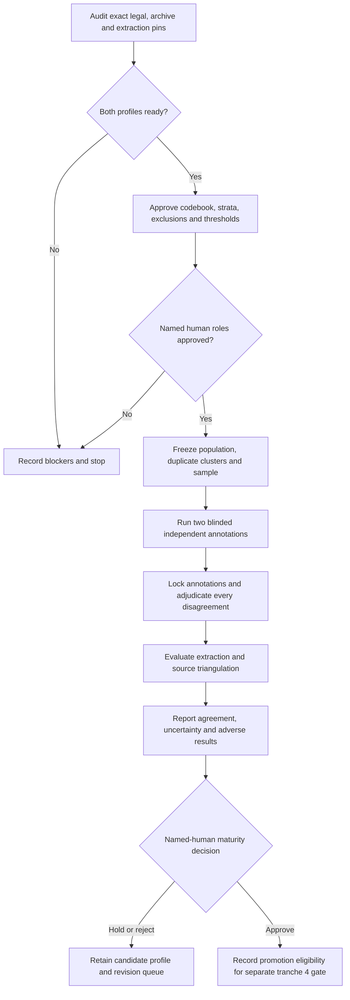

# Tranche 3 empirical-validation workflow

This workflow applies separately to `foio-au-cth` (`AU-CTH`) and
`foio-au-nsw` (`AU-NSW`). It consumes only hash-pinned owner-repository
artifacts. Platform observations are evidence, not legal rules, and a completed
empirical run cannot promote either profile.

## Execution rules

1. Run `python scripts/validate_australian_empirical_readiness.py --require-ready`.
   Exit code 2 means no sample may be frozen.
2. Freeze the approved source population, codebook, sampling configuration,
   duplicate clusters and exact sample before showing any unit to an annotator.
3. Two distinct named human annotators work blind to each other and to model
   candidates. A third named human adjudicates all label, span and abstention
   disagreements.
4. Run the existing authentic-bundle verifier and publish all pre-registered
   denominators, missingness, abstentions, disagreement and uncertainty.
5. Route source conflicts through the v0.2.0 triangulation contract, which
   records controlling authority without converting it into a legal conclusion.
6. Stop before profile promotion, publication, release or tranche 5 expansion.

The paired BPMN 2.0 representation is [`phase-3-workflow.bpmn`](phase-3-workflow.bpmn).
