# Australian jurisdiction rollout workflow

```mermaid
flowchart LR
    D["Discover metadata"] --> S["Select bounded URLs"]
    S --> G1{"Replay authorized?"}
    G1 -->|no| P1["Generate approval packet"]
    P1 --> G1
    G1 -->|yes| R["Replay with durable checkpoints"]
    R --> X["Reconcile failures"]
    X --> C["Classify metadata, then text"]
    C --> V["Validate artifacts"]
    V --> G2{"Manifest finalization authorized?"}
    G2 -->|no| P2["Generate approval packet"]
    P2 --> G2
    G2 -->|yes| M["Finalize immutable manifest"]
    M --> G3{"Empirical frame authorized?"}
    G3 -->|no| P3["Generate approval packet"]
    P3 --> G3
    G3 -->|yes| F["Build frame and sample"]
    F --> K["Run calibration"]
    K --> G4{"Calibration and annotation gates pass?"}
    G4 -->|no| Q["Remediate codebook or evidence"]
    Q --> K
    G4 -->|yes| A["Annotate and adjudicate"]
    A --> E["Evaluate reliability and extractor"]
    E --> G5{"Maturity review authorized?"}
    G5 -->|no| P5["Generate maturity packet"]
    P5 --> G5
    G5 -->|yes| O["Record bounded maturity decision"]
```

Every transition verifies predecessor output pins, the checkpoint self-digest,
the transformation contract version, and the authority envelope. A generated
packet proposes a gate; it never satisfies that gate.
