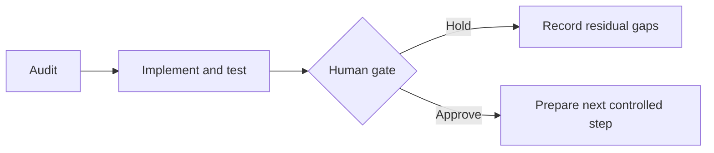

# paper global impact and reproducibility workflow

```mermaid
flowchart LR
  A[Audit] --> B[Implement and test]
  B --> C{Human gate}
  C -- Hold --> D[Record residual gaps]
  C -- Approve --> E[Prepare next controlled step]
```
