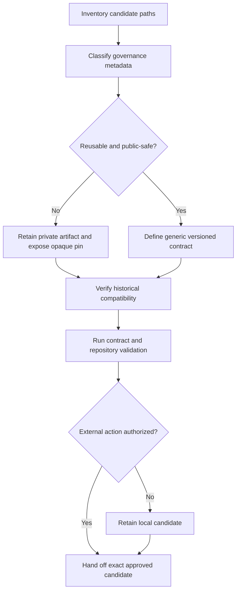

# Public governance-metadata refactor workflow

Raw approvals, request identifiers, local paths, credentials, restricted source
metadata, and receipts never enter the reusable public contract. Historical
evidence remains immutable and is referenced by opaque content pins.
