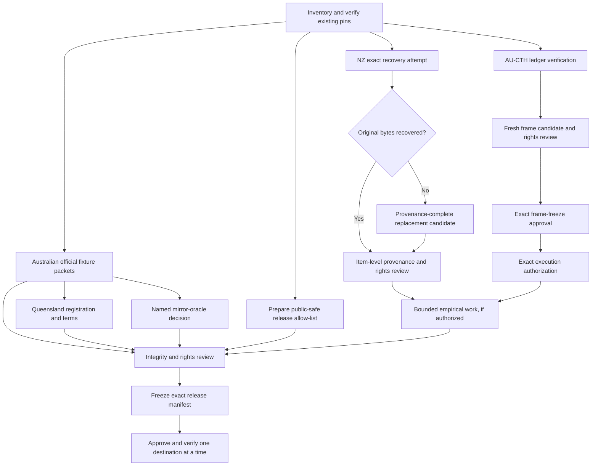

# Six-gate resolution plan

Status: recommended execution plan; it records options and sequencing but does
not satisfy or authorize any gate.

## Objective and operating rule

Resolve the six remaining evidence and publication gates with the smallest
rights-cleared, hash-pinned evidence set that can support the intended bounded
work. Repository-owned preparation proceeds autonomously. Source retrieval,
credential use, authentic-content use, empirical execution, maturity decisions,
and external publication remain fail-closed until their exact gate is satisfied.

Historical approvals and receipts remain evidence for their original scope.
They do not authorize a replacement payload, a new frame, the current
repository revision, or a new destination action.

## Recommended dependency sequence

The NZ, Australian-source, AU-CTH, and release-manifest preparation lanes may
run in parallel. A downstream arrow is a prerequisite, not inferred approval.

## Decision summary

| Gate | Recommended option | Primary contingency | Decision owner |
| --- | --- | --- | --- |
| NZ payloads and authentic-content rights | Recover byte-identical originals, then perform item-level rights review | Prepare a new one- or two-case replacement candidate with full provenance and obtain new approval | Artifact custodian and rights reviewer |
| Remaining Australian official fixture rights | Approve restricted-local, official-first representative fixtures jurisdiction by jurisdiction | Keep metadata-only disabled scaffolds where terms or stable bytes remain unavailable | Rights reviewer |
| Queensland API | Complete official registration and accept the pinned terms in a user-controlled credential environment | Use official public HTML/PDF only for disabled adapter-shape work | Account holder and credential custodian |
| Mirrors | Permit named mirrors only as independent identity/oracle evidence | Use no mirror when terms, identity, or independence cannot be established | Rights and methodology reviewer |
| AU-CTH fresh frame and execution | Verify the replacement ledger, freeze one exact fresh frame, then activate the existing conditional execution gate against that frame | Preserve historical maturity and defer fresh evaluation | Rights/frame approver, then execution approver |
| Release and publication | Freeze a current-HEAD public-safe allow-list manifest, then authorize one destination at a time | Retain a validated local bundle and publish nothing | Release owner and destination owner |

## Gate 1 — Recover or replace NZ payloads and approve authentic-content rights

### Evidence already pinned

The authoritative recovery outcome is
`docs/97-nz-empirical-payload-recovery-outcome-2026-08-03.md`. The four expected
local roots are absent. Their recorded artifact pins remain expectations, not
recovered content:

- request 11872 manifest:
  `0c7cee553ca3b01a6416784a1b691df5a6d90159a8f4d55e51a799934f655629`;
- request 11872 inventory:
  `a0dfea7c979de9760bcf12fee0a321e8e323b4176decd086f2530408da4c171f`;
- request 35076 bundle:
  `c929b312f4b627049b7867e46fa74b08ed8e9a43c35ba866871bead6f8a19b7d`;
- request 35076 candidate:
  `90550ce084be684ee493e2ce7470cbe0b01dee13b6253c50f91c7de9974d6007`;
- request 35076 verification:
  `23270c27202286e3476f39ccf5df2267cb41641f9cfdf3f1664b8f23e441a9a1`.

### Options

1. **Recover byte-identical originals (recommended).** Search only approved
   owner-controlled backups or artifacts, validate safe members, reproduce all
   recorded hashes, and preserve the original lineage. This best maintains the
   already reviewed membership and minimizes methodological drift. Its cost is
   continued delay if the bytes no longer exist.
2. **Create a provenance-complete replacement.** Select a bounded authentic
   replacement source, record source URL/provider, retrieval authorization,
   timestamp, terms, byte hashes, transformation lineage, membership diff, and
   exclusions, then seek a new exact rights/frame approval. This is recoverable
   but invalidates any approval bound to the missing bytes.
3. **Reduce to one recoverable case.** If only one authentic case can be
   governed, register a new one-case feasibility pilot. This is faster but
   materially weakens comparison and cannot be represented as the original
   two-case pilot.
4. **Defer empirical execution.** Preserve metadata, schemas, and synthetic
   tests only. This carries no content-rights risk but leaves empirical claims
   unavailable.

### Recommended execution and evidence contract

Run one bounded final recovery audit against named owner-controlled locations.
If no exact match is found, stop searching and prepare Option 2; do not
reconstruct source bytes from derivatives. For each recovered or replacement
item, record the manifest hash, byte hash, source identity, retrieval time,
provider terms, rights disposition, access controls, retention, exclusions,
and source-to-derivative map. Do not repeat broad filesystem searches without
a newly named custodian location: the documented locations have already been
exhausted. Review HTML, correspondence, attachments, and
derived text separately using the matrix in
`docs/98-nz-authentic-source-content-rights-approval-packet-2026-08-03.md`.
For request 11872, preserve the distinction between its canonical empty FYI
attachment inventory and any supplemental HTML-derived attachments.

### Stop conditions and contingency

Stop on any hash/count/unit mismatch, unsafe archive member or symlink,
unexpected file, group/world-readable source material, unresolved custody,
missing source identity or retrieval evidence, ambiguous correspondence or
attachment rights, non-empty derived execution directories before authorized
processing, or attempt to infer content rights from the metadata-only source
pack. The contingency is a new replacement packet, not a silent substitution.
No analyst execution begins until the exact payload, clean repository revision,
pre-materialization verification, and authentic-content rights are approved.

## Gate 2 — Approve official fixture rights for remaining Australian jurisdictions

### Options

1. **Official-first restricted-local fixtures (recommended).** For AU-VIC,
   AU-ACT, AU-SA, AU-TAS, AU-WA, and AU-NT, retain a minimal representative
   official fixture and terms snapshot only after its URL, timestamp, MIME,
   byte count, SHA-256, authority status, effective-date semantics, permitted
   use, and exclusions are recorded. This supplies defensible parser evidence
   while avoiding redistribution.
2. **Metadata-only disabled scaffolds.** Keep identity, format, and negative
   fixtures without retaining authentic content. This is safe and useful for
   interfaces, but cannot establish parser fidelity or source-pack maturity.
3. **Broad corpus retention.** Capture many official records at once. This may
   reduce later retrieval overhead but expands rights, storage, review, and
   change-management risk before the representative route is proven.

### Recommended tranche order and rationale

Use Option 1 in small tranches: TAS/ACT first because their format and
authority boundaries are substantially documented; VIC/WA/NT next after
stable rendition identity is proven; SA when its official route can be
accessed without bypassing controls; QLD follows Gate 3. Store authentic bytes
outside the repository and commit only rights-safe fixtures or hashes unless
redistribution is explicitly approved. Keep PDF, XML, HTML, Word, Gazette, and
API renditions as separate evidence classes.

The required record shape is defined by
`source-rights-evidence-register.yaml`. Rights approval must enumerate the
jurisdictions and exact fixture hashes. Public availability, accessibility, or
an official domain alone is insufficient.

### Contingencies

- On HTTP 403, bot protection, or unstable routes, preserve the failure receipt
  and use official index/terms metadata only; do not bypass controls.
- If no stable XML exists, use a format-specific official HTML/PDF parser while
  retaining the authoritative-rendition boundary.
- If terms conflict or exclude material, remove that item or keep the entire
  jurisdiction candidate and disabled.
- When a source changes, create a new versioned candidate and retain the old
  hash; never rewrite historical evidence.

## Gate 3 — Complete Queensland API registration and terms acceptance

### Options

1. **Official API registration (recommended).** The user completes registration
   and accepts the exact terms in an approved interactive environment. Store
   credentials only in the approved secret store or task-shell environment,
   never in repository files, logs, evidence ledgers, or chat. Retrieve one
   non-sensitive fixture only after the registration and fixture-use gates are
   recorded.
2. **Official public HTML/PDF fallback.** Build disabled adapter-shape and
   negative tests against public official routes. This avoids credential delay
   but does not prove API semantics or authorize runtime API capability.
3. **Defer Queensland.** Keep the profile and API capability blocked while the
   other jurisdictions proceed. This avoids terms risk but delays national
   completeness.

### Required evidence

Record the account/credential custodian without recording credentials, terms
URL and version or hash, acceptance time, approved scopes, rate limits,
privacy/retention constraints, API base URL, and one bounded fixture receipt.
Verify JSON/XML/HTML/PDF identity where available. Treat changed terms,
revocation, authentication failure, or unconfirmed custody as a closed gate.

### Contingency and trade-off

Use Option 2 only to keep local interface work moving and label it disabled.
Do not use a mirror, scraped endpoint, or another person's credentials to
simulate completion. If the registration route remains unavailable, leave QLD
candidate and continue the independent jurisdiction lanes.

## Gate 4 — Decide whether mirrors may be used as independent comparators

### Options

1. **Named mirrors as independent comparators only (recommended).** Permit an
   explicitly named mirror, such as AustLII, to compare identity, dates,
   structure, or expected text against the official source. It cannot establish
   authority, rights, empirical membership, or replace an official fixture.
2. **No mirrors.** Use only official sources. This is simplest legally, but
   loses a useful independent cross-check and may make official-source defects
   harder to detect.
3. **Mirrors as fallback sources.** Allow mirror content when official access
   fails. This improves availability but conflates convenience with authority
   and imports a separate rights/provenance regime; it is not recommended for
   source packs or empirical populations.

### Oracle admission contract

For each named mirror, record owner, URL, retrieval time, terms, item hash,
independence assessment, compared official item/hash, comparison method, and
allowed fields. Oracle output is advisory: a disagreement enters a queue and
does not overwrite official evidence. Mirror bytes remain restricted-local
unless their own redistribution terms are approved. If independence or terms
cannot be established, apply Option 2 for that mirror.

Reserve `independent oracle` for an independently implemented validator; call
an external mirror an `independent comparator` to avoid implying authority.
Before admitting any mirror operationally, extend the triangulation contract
with an explicit non-authoritative source role (recommended name:
`mirror_comparator`) and positive/negative tests proving that such assertions
cannot become controlling authority or satisfy minimum supporting-source
counts. The current authority-tier-only contract cannot enforce this boundary
if a mirror is mislabelled, so a policy approval alone is insufficient.

## Gate 5 — Approve the AU-CTH fresh frame and execution

### Dependency sequence

1. Retire the stale 10,000-row fresh-holdout candidates from freeze
   consideration and reconcile their earlier retrieval-evidence pin with the
   subsequently reverified complete 26,000-record CDX retrieval evidence
   SHA-256
   `0795be14775616416f61fb4131c397e7f2496f72c9fc534a357a98ec6e827331`.
   Preserve the stale candidates as history; do not rewrite their hashes.
2. Independently verify pending replacement-ledger candidate SHA-256
   `8da8534a2f663bab7b6ed263797baf16aeb9ae00665e1e35e3ba359228180b42`
   against selection SHA-256
   `a1c2308ecc81de3754f37b3c26f7ba7fc232ff5bac930b86b36fb10463178c51`,
   CDX SHA-256
   `954b0f80ad2a44038f364d240cc9baac815f252a43535c8403dec060ddb730bd`,
   and parent manifest SHA-256
   `246cd65c3c60733fb31478b07f12bd251877b1efe9559643d5c566bc337d0ff8`.
3. Obtain an exact disposition decision for the nine records. Verification
   alone does not establish HTTP 404 status.
   The recommended practical replacement is an explicit
   `unavailable/unverified full-text` exclusion disposition unless independent
   response evidence supports a more specific historical status.
4. Build a fresh candidate frame from the completed retained population,
   excluding calibration URLs, prior-evaluation units, and their duplicate
   clusters; record membership, exclusions, cluster registry, ordering, seed,
   source rights, and self-pin.
5. Obtain exact frame-freeze and rights approval.
6. Generate a refreshed execution authorization bound to that exact frame,
   membership, codebook, protocol, isolated roles, and clean repository
   revision. Prefer this exact refresh over relying on the older generic
   conditional approval.
7. Run bounded annotation, reconciliation, reliability, and any separately
   authorized maturity review. Preserve historical 100-unit maturity as a
   separate bounded result.

### Options

1. **Complete the fresh remediation chain (recommended).** It resolves the
   outstanding evidence defect and supports a new scope-bound decision, at the
   cost of another exact approval and evaluation cycle.
2. **Retain historical maturity and defer fresh evaluation.** This is honest
   and low-cost, but the fresh-remediation claim remains pending.
3. **Create a smaller fresh frame.** This lowers workload but requires a new
   sampling justification and may not satisfy registered reliability goals.

### Stop conditions

Stop on ledger/hash mismatch, unverifiable disposition, calibration leakage,
duplicate-cluster overlap, changed codebook/protocol/HEAD, or incomplete
rights. Never reinterpret the pending ledger candidate as a verified 404
ledger. Never let a fresh failure revoke or rewrite the historical bounded
decision; record the scopes independently.

## Gate 6 — Approve an exact release manifest and destination-specific publication

### Options

1. **Public-safe allow-list release (recommended).** Freeze a manifest at the
   intended clean commit containing only code, schemas, documentation,
   synthetic examples, and safe provenance metadata. Exclude authentic source
   text, archive payloads, attachments, restricted evidence, credentials,
   unapproved empirical records, training data, and legal conclusions.
2. **Metadata-only release.** Publish schemas, hashes, provenance indexes, and
   limitations without derived empirical outputs. This maximizes safety but
   provides less reproducibility.
3. **Include approved empirical outputs.** This improves reproducibility but
   requires item-level rights, privacy, claim, and destination review for every
   included artifact. It must be a new manifest, not an expansion by inference.
4. **Local validated bundle only.** Freeze and verify the bundle but take no
   external action. This is the universal contingency.

### Recommended release contract

Create a machine-readable allow-list manifest containing the exact commit,
file paths, per-file SHA-256, bundle hash, license, provenance dependencies,
validation results, explicit exclusions, intended visibility, and destination
metadata. Run independent integrity and rights/publication reviews. Any
disagreement removes the item or blocks the manifest.

After the manifest is approved, authorize and execute at most one destination
at a time: GitHub release, Hugging Face, Zenodo, OSF, or website/docs. Each
authorization must name the manifest hash, commit, destination identity,
visibility, and one action. Verify the post-upload revision or hashes and
record an immutable receipt before moving to another destination. Historical
receipts do not authorize the current manifest.

Before using the historical publication packet as evidence, reconcile its
chronology: it records completed Zenodo and OSF receipts and later contains an
older section saying those actions were not executed. Preserve both records,
identify the later verified state, and mark the superseded execution-check
section explicitly. Do not alter historical receipt bytes or treat the packet
as the current release manifest.

### Contingencies and stop conditions

On a changed commit, file set, license, visibility, destination, or upload
result, invalidate the pending authorization and regenerate the manifest.
Stop on unexpected files, hash mismatch, restricted content, unclear rights,
authentication ambiguity, or destination-side transformation. The fallback is
Option 4, never an inferred alternate destination.

## Autonomous execution boundary

The orchestrating agent may autonomously:

- search approved local and repository-owned evidence locations read-only;
- generate candidate inventories, manifests, rights matrices, hash reports,
  decision packets, disabled scaffolds, tests, and validation evidence;
- reconcile Conductor metadata, plans, workflows, and append-only evidence;
- run local repository-native and Conductor validation; and
- prepare exact approval statements after the relevant hashes exist.

It must stop for the accountable decision or external gate before:

- accessing a new authentic source or using authentic content without the
  applicable retrieval/rights authority;
- accepting terms or entering, storing, or using credentials;
- treating a mirror as admissible oracle evidence;
- freezing a new empirical frame, executing annotation/evaluation, or deciding
  maturity when the exact prerequisite approval is absent; or
- pushing, merging, tagging, releasing, uploading, publishing, or depositing.

## Approval grouping and readiness rule

The decisions may be presented in three groups, but each approval remains
artifact-specific:

1. **Source and rights:** NZ recovered/replacement payload; named Australian
   fixture hashes; Queensland terms/account custody; named mirror policy.
2. **Empirical:** verified AU-CTH ledger disposition; exact fresh frame and
   rights; exact execution authorization; later maturity decision.
3. **Release:** exact current-HEAD manifest and integrity/rights review;
   separate destination-specific actions.

Do not request a placeholder hash approval. Prepare the exact statement only
after its candidate exists and independently rehash it immediately before the
decision. Local validation may advance preparation but cannot satisfy any of
these gates.
