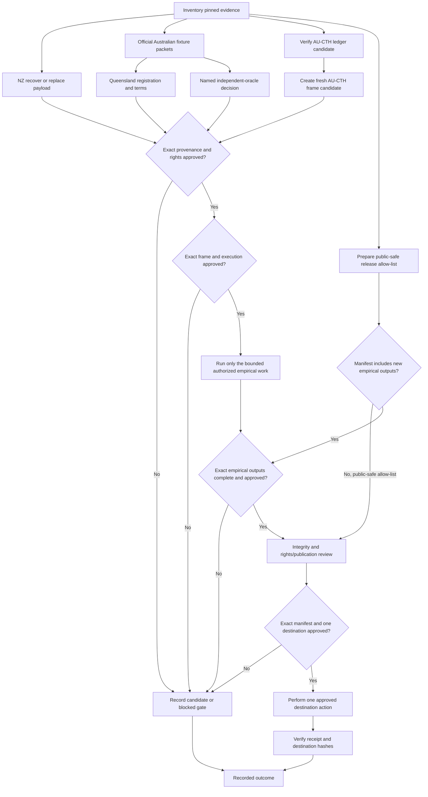

# Remaining gates workflow

The NZ, Australian-source, AU-CTH, and release-preparation lanes may proceed in
parallel, but each joins through its own exact evidence gate. A public-safe
code, schema, documentation, synthetic-example, and provenance-metadata
manifest may proceed without unresolved empirical outputs; an
empirical-inclusive manifest may not. No branch
authorizes live capture, credential use, authentic-content processing,
empirical execution, publication, redistribution, training, legal
certification, or profile promotion by inference.
