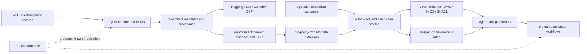

# System architecture

FOI-O is the semantic and jurisdiction-contract layer in a multi-repository
programme. FOI-O NZ is its currently implemented jurisdiction profile. Capture,
archiving, OCR, extraction, rules, and programme conformance remain separate so
that their provenance and approval boundaries are inspectable.

## Layers

### 1. Source layer

Public sources include FYI.org.nz request pages, Alaveteli metadata,
attachments, versioned legislation packs, public guidance, PSC statistics, and
Ombudsman complaint data. Alaveteli is a source of workflow intelligence and
public metadata, not an implementation dependency for FOI-O governance.

### 2. Archive layer

`fyi-cli` captures source and delta inputs. `fyi-archive` preserves source
material, produces manifests and publication packages, and sends versioned
datasets to Hugging Face and preservation services. This layer prioritises
fidelity over interpretation.

### 3. Semantic layer

`foi-process` supplies document-evidence and OCR views. `nlp-policy-nz` evaluates
review-bounded candidate extraction. FOI-O maps accepted evidence into events,
states, controlled vocabularies, legal references, and validation constraints;
`rulespec-nz` supplies deterministic NZ rules. Candidate extraction is never
equivalent to profile promotion.

### 4. Agent layer

Agents consume typed resources and tools. Their outputs remain preparatory unless a human with authority certifies a decision-like event.

Australian Commonwealth and NSW adapters are pilot consumers of the same
contract. They remain disabled or candidate-only until immutable source and
model pins, rights-reviewed heldout data, independent annotation and
adjudication, empirical metrics, and explicit human promotion are recorded.

### 5. Reporting and evaluation layer

The event log should support:

- state mapping evaluation;
- extraction accuracy measurement;
- statutory clock calculation tests;
- reporting-metric generation;
- public/private data boundary checks;
- audit and reproducibility reports.
