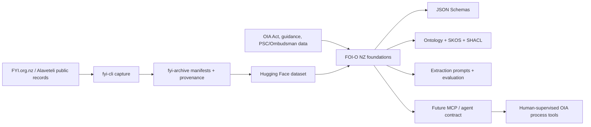

# System architecture

FOI-O NZ should sit above the archive and tooling layers.

## Layers

### 1. Source layer

Public sources include FYI.org.nz request pages, Alaveteli metadata, attachments, legislation, public guidance, PSC statistics, and Ombudsman complaint data.

### 2. Archive layer

`fyi-cli` and `fyi-archive` preserve source material and produce manifests. This layer should prioritise fidelity over interpretation.

### 3. Semantic layer

FOI-O NZ maps source material into events, states, controlled vocabularies, legal references, and validation constraints.

### 4. Agent layer

Agents consume typed resources and tools. Their outputs remain preparatory unless a human with authority certifies a decision-like event.

### 5. Reporting and evaluation layer

The event log should support:

- state mapping evaluation;
- extraction accuracy measurement;
- statutory clock calculation tests;
- reporting-metric generation;
- public/private data boundary checks;
- audit and reproducibility reports.
