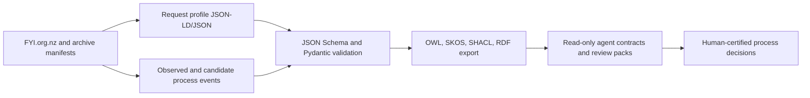

**Keywords:** Official Information Act; ontology engineering; process mining;
public administration; legal informatics; agent safety.

# Introduction

Official Information Act (OIA) administration is process-intensive. A request
may involve intake, acknowledgement, clarification, extension, transfer,
decision, release, refusal, redaction, complaint, publication, and reporting
steps. Public request records can expose parts of this sequence, especially when
requests are handled through public platforms such as FYI.org.nz. Those records
are useful, but they are not agency systems of record. They contain observed
messages, platform labels, attachments, timestamps, and sometimes incomplete
or ambiguous state signals.

FOI-O NZ addresses this gap by separating observable evidence from process
interpretation. The repository provides an agent-facing process ontology,
schema contracts, validation tools, and publication metadata for New Zealand
OIA workflows. Its first principle is that agents may assist with routing,
summarisation, event extraction, validation, and review preparation, but they
must not certify legally meaningful outcomes. Authorised humans remain
responsible for release, refusal, redaction, charging, extension, transfer,
complaint, and publication decisions.

The contribution of the current repository is a bounded, reproducible methods
package rather than a live public-service system. It defines an auditable data
model, semantic layer, quality gates, local examples, and tests that can be
inspected without live credentials or private request content.

# Methods

## Design Principles

FOI-O NZ was developed around five design principles.

| Principle | Implementation consequence |
| --- | --- |
| Preserve source-state evidence | Store observed source labels, timestamps, and evidence references before mapping them to normalised states. |
| Separate observation from certification | Candidate events and inferred states carry assertion status and review metadata rather than final legal authority. |
| Keep semantics inspectable | JSON Schema, SKOS, OWL/RDF, SHACL, mappings, and examples are committed as repo-local artefacts. |
| Fail closed around legal outcomes | Agent contracts and quality gates reject autonomous certification of decision-like outcomes. |
| Prefer reproducible local proof | Tests, examples, and validation commands define what the repository can currently prove. |

## Repository Architecture

The architecture follows a source, archive, semantic, agent, and evaluation
layering pattern. Source request records and archive manifests are preserved
upstream. FOI-O NZ maps those records into request profiles, event streams,
controlled vocabularies, RDF/SHACL artefacts, and bounded agent resources.

The Python control plane owns schema validation, FYI manifest normalisation,
event extraction, quality gates, reporting profiles, RDF export, SHACL
validation, release metadata, and command-line workflows. Optional surfaces such
as FastMCP, pySHACL, LanceDB, Mojo, and MAX add runtime capability when
installed, but deterministic Python and fixture-backed paths remain the
repo-local compatibility proof.

## Ontology Development Protocol

The ontology-development protocol uses repository evidence as the source of
truth:

1. identify process concepts from OIA request workflows, FYI/Alaveteli source
   states, statutory-process concepts, publication metadata, and reporting
   needs;
2. encode operational contracts as JSON Schemas and Pydantic models before
   adding richer semantic alignments;
3. define controlled vocabularies for request states, event types, assertion
   status, and agent boundaries using SKOS;
4. align event, evidence, dataset, and policy concepts with PROV-O, DCAT, ODRL,
   SKOS, and legal-document references where appropriate;
5. express safety and consistency constraints in SHACL;
6. validate examples and code paths through tests, release-readiness checks, and
   machine-readable publication metadata.

The core event contract is `schemas/json/core-event.schema.json`. Semantic
constraints are represented in `shacl/foi-o-nz.shapes.ttl`, and semantic
alignment notes are maintained in `docs/22-semantic-alignment.md`.

## Data Model

The model is organised around request profiles, process events, agent actions,
review tasks, ledgers, chunks, risk assessments, reporting metrics, and release
metadata. Events carry assertion status, provenance, generator metadata,
evidence references, and human-certification metadata. Candidate process events
can support triage and review, but they are not promoted to certified outcomes
unless an authorised human record supplies the certification evidence.

| Surface | Current role |
| --- | --- |
| Request profile schema | Describes request-level metadata, source state, identifiers, and JSON-LD context. |
| Core event schema | Describes observed or candidate process events with evidence and assertion status. |
| SHACL shapes | Adds semantic validation and safety constraints over RDF exports. |
| Agent action schema | Bounds tool-like agent outputs to preparatory actions. |
| Release metadata | Records repo-local evidence, rights notices, and external gates. |

## Human Certification Boundary

The human boundary is redundant by design. It appears in schemas, model logic,
quality gates, agent policies, MCP/tool descriptors, SHACL shapes, examples,
tests, and publication metadata. Agents may map observed states, propose
candidate events, assemble review packs, compute indicative clocks, and check
evidence completeness. They must not certify legal outcomes.

This boundary is a scientific and governance constraint, not a cosmetic warning.
It prevents evaluation metrics, local extraction, retrieval, or agent contracts
from being represented as legal determinations.

# Results

## Implemented Repository Surfaces

The current repository includes implemented contracts for JSON Schema examples,
Pydantic models, state mapping, manifest normalisation, event analytics,
quality gates, RDF export, reporting profiles, publication metadata,
reproducibility manifests, local retrieval, redaction candidates, agent context
packs, stream diffs, and read-only agent descriptors. The Mojo/MAX and LanceDB
paths are experimental and optional.

| Evidence surface | Repo-local evidence | Validation command |
| --- | --- | --- |
| Schemas and examples | `schemas/json/`, `examples/` | `uv run python scripts/validate_examples.py` |
| Core Python behavior | `src/foi_o_nz/`, `tests/` | `uv run pytest -q` |
| Release readiness | `docs/19-release-readiness-evidence.md` | `uv run ruff check src tests scripts` |
| Publication metadata | `examples/repository-release-metadata.v0.9.0.json` | `uv run pytest -q tests/test_publication_metadata.py` |
| Semantic alignment | `ontology/`, `vocab/`, `shacl/` | `uv run pytest -q tests/test_semantic_alignment.py tests/test_shacl_safety_profiles.py` |

## Publication and Preprint Readiness

The submission package now includes target requirements
(`docs/26-journal-target-requirements.md`), this manuscript
(`docs/27-submission-manuscript.md`), a supplement
(`docs/28-submission-supplement.md`), and an arXiv readiness workflow
(`docs/30-arxiv-readiness.md`).

The preprint packaging plan uses `arxiv-latex-cleaner` as the default source
sanitizer, TeX Live 2025 and `latexmk` for compile proof, conditional
`arxiv-collector` or `latexpand` when dependency collection or source flattening
adds value, optional ALC-NG for second-pass sanitization, and package hygiene
scans for secrets, local paths, comments, stale files, metadata, and fonts.
The current readiness report is
`examples/arxiv-readiness.manuscript-planned.json`.

# Discussion

FOI-O NZ treats public OIA workflow data as a process-modelling and validation
problem rather than as an autonomous legal-decision problem. This distinction is
important for agent-facing systems. The same event stream that helps a reviewer
find missing evidence could be misused if a model is allowed to treat candidate
events as certified statutory outcomes. The repository therefore keeps
assertion status, provenance, human review, and certification metadata close to
the data model.

The schema-first approach also has practical advantages. JSON Schema and
Pydantic models provide early validation for examples and command outputs. SKOS
vocabularies make state and event terminology inspectable. RDF and SHACL give a
path toward richer semantic validation without forcing every user to install
heavy semantic-web tooling. Release metadata and checklist examples make
publication boundaries explicit.

The main limitation is empirical scale. The current repository can prove local
contracts, examples, and deterministic transformations. It does not yet prove
live archive intake, large gold-set performance, external registry publication,
or agency-internal reporting completeness. Those claims should remain external
gates until they are supported by live-source evidence, human review, and
separate validation.

# Limitations

FOI-O NZ is not legal advice, is not an official New Zealand government
publication, and is not an official Public Service Commission reporting system.
It does not retrieve live source systems by default, republish source FYI/archive
payloads, replace agency records, decide statutory interpretation, or certify
OIA outcomes. Registry publication, arXiv upload, journal submission, final
author metadata, and live service checks require human approval.

# Conclusion

FOI-O NZ provides a bounded ontology and validation stack for modelling New
Zealand OIA administration in agent-facing workflows. Its contribution is a
reproducible, human-supervised process layer: schemas, vocabularies, semantic
constraints, examples, release metadata, and tests that distinguish observed
evidence, candidate inference, and certified human outcomes. This design offers
a practical foundation for future corpus evaluation, process analytics,
publication packaging, and safer agent-assisted public-information workflows.

# Data and Code Availability

The code, schemas, ontology seed, examples, documentation, and validation
contracts are maintained in the GitHub repository
`https://github.com/edithatogo/foi-o`. Source request/archive content is not
republished by this manuscript and remains subject to its original rights and
platform terms.

# Ethics and Legal Boundary

This work is process-support-only. It does not provide legal advice or certify
legal outcomes. Human approval is required before live publication, journal
submission, arXiv upload, or any operational use that would affect OIA request
handling.

# Author Contributions

Author contribution details require human confirmation before submission.

# Funding

Funding information requires human confirmation before submission.

# Conflicts of Interest

Conflict-of-interest declarations require human confirmation before submission.

# References

- New Zealand Official Information Act 1982.
- FOI-O NZ repository documentation: `README.md`, `docs/02-system-architecture.md`,
  `docs/07-evaluation-plan.md`, `docs/19-release-readiness-evidence.md`,
  `docs/22-semantic-alignment.md`, `docs/23-methods-paper.md`,
  `docs/23-release-package.md`, `docs/26-journal-target-requirements.md`, and
  `docs/30-arxiv-readiness.md`.
- Repository contracts and examples: `schemas/json/core-event.schema.json`,
  `shacl/foi-o-nz.shapes.ttl`, `examples/release-checklist.v0.9.0.json`, and
  `examples/repository-release-metadata.v0.9.0.json`.
