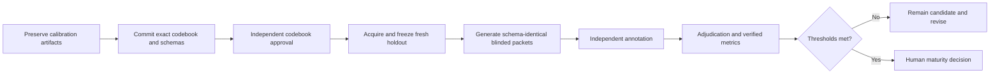

# AU-CTH annotation outcome and remediation

Status: calibration diagnostic; not maturity evidence, gold data, or a legal
conclusion. Recorded 2026-07-22.

## Outcome

The bounded AU-CTH run used nine authentic Internet Archive captures from the
approved source population. Two isolated automated annotator roles and one
distinct automated adjudicator completed the run.

| Measure | Result | Registered threshold | Interpretation |
| --- | ---: | ---: | --- |
| Primary-label agreement | 7/9 (77.78%) | >= 80% | Failed |
| Cohen's kappa | 0.40 | >= 0.60 | Failed |
| Primary-label disagreements | 2/9 | n/a | `observed` versus `unknown` |
| Span disagreements | 8/8 non-abstaining units | n/a | Span rule is not operationally consistent |
| Abstention agreement | 1/1 unreadable unit | n/a | Both roles abstained for missing evidence |

The adjudicator queue contained eight units because it included span
differences; it must not be reported as eight primary-label disagreements.
The adjudicated artifact SHA-256 is
`6786bfad11202cf8707058fefd208f548a87499cd5702e70b7cf5f447d8f464e`.

## Evidence-integrity assessment

This run cannot support profile maturity or extractor claims:

1. The executed codebook, execution frame, packets, labels, and adjudication
   artifact were created under `/tmp`; only hashes and summary records are
   committed. `/tmp` is not a durable evidence store.
2. The executed codebook revision
   `3642e28000000000000000000000000000000000` was mechanically padded rather
   than a genuine repository revision. It is not acceptable provenance.
3. The two annotators used structurally different label-output shapes. The
   agreement calculation normalized a null abstaining label to `unknown`; that
   normalization must be specified and tested before a governed rerun.
4. The nine-unit census is useful for feasibility and calibration, but it is
   not the preregistered 385-unit jurisdiction frame or 100-unit paired
   reliability sample. No population inference is permitted.
5. The labels were produced by automated agent roles. They are not human
   annotations and must not be described as human-reviewed or gold.
6. Reusing these nine units after codebook revision would measure training or
   calibration fit. They must remain calibration-only unless the result is
   explicitly reported as a non-independent sensitivity analysis.

## What the disagreements mean

The primary-label failures occur at the boundary between explicit evidence
and insufficient jurisdictional evidence. The codebook names four epistemic
labels but does not define a sufficiently precise target assertion, evidence
window, jurisdiction-identification rule, or null/abstention serialization.
The span failures show that “cite a span” is underspecified: one role selected
a narrow evidentiary phrase while the other selected a whole-document span.

The immediate response is therefore contract repair and fresh validation,
not threshold relaxation. The registered 0.80/0.60 thresholds remain fixed.

## Remediation workflow

The executable tasks, gates, and acceptance criteria are maintained in
`conductor/tracks/au_cth_annotation_reliability_remediation_20260722/`.

## Fresh-holdout coverage inventory

A read-only Internet Archive CDX query for
`www.righttoknow.org.au/request/*` retrieved 10,000 bounded rows at
`2026-07-22T13:41:09Z`, with export SHA-256
`e9560805c2ae6ab97baa46a211afebb408f89da5b366551c142df8e11d9a42c0`.
Within that bounded response there were 224 canonical request URLs, including
220 candidates outside the four calibration URLs. This establishes that a
fresh candidate pool exists, but not that it is complete, rights-eligible,
full-text available, or suitable for sampling. The coverage record is
`examples/v2/au-cth-fresh-holdout-coverage.pending.json`.

The exact source-approval packet is
`examples/v2/au-cth-fresh-holdout-source-approval.pending.json`; it does not
freeze the holdout or authorize annotation.
