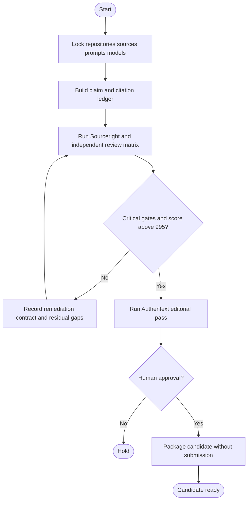

# Paper update and release-candidate workflow

The workflow locks exact inputs, audits claims and sources, runs independent
review roles, and stops at the human publication gate. It is a preparation
workflow, not an autonomous submission path.

